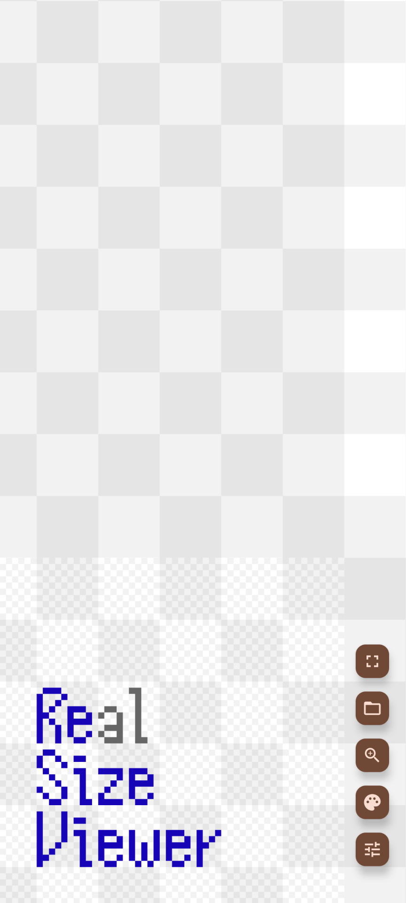
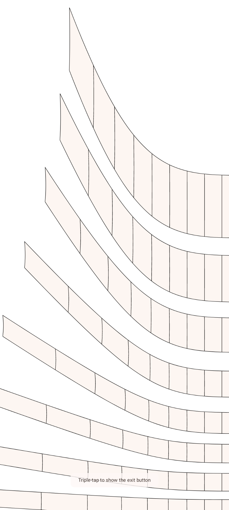
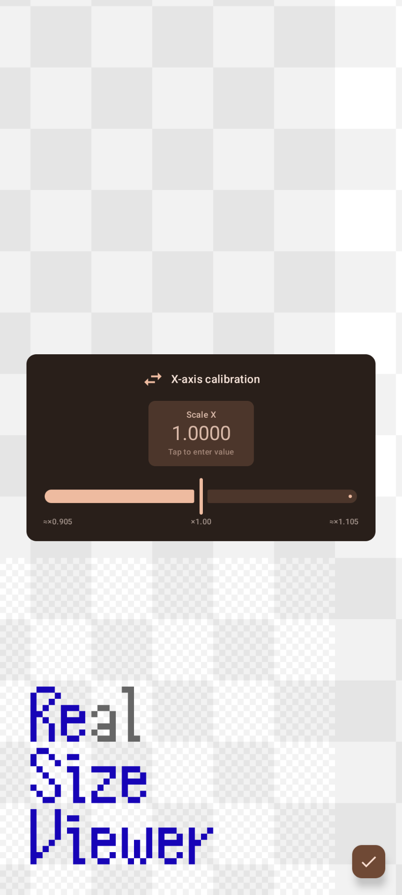

# Re(al)SizeViewer

An Android app that displays SVG and PDF files at their true physical size on your screen.

Use it for pre-print verification, checking product part dimensions, or viewing DIY blueprints at actual scale.

[](https://f-droid.org/packages/io.github.hyrodium.realsizeviewerapp/)

## Screenshots

| Alignment mode (default) | Fullscreen mode with a user image | Calibration mode |
|---|---|---|
|  |  |  |

## Features

- **Real-size display** of SVG / PDF files using device DPI
- **Three operation modes**
  - *Fullscreen*: hides all UI for clean viewing
  - *Alignment*: drag to move, two-finger gesture to rotate
  - *Calibration*: pinch to adjust DPI correction factor per axis
- Custom zoom factor (numeric input)
- Background color presets
- Keep screen on
- Optional anonymous submission of DPI calibration data to improve recommendations for other users

## Build

Requires Android Studio or the Android SDK command-line tools.

```bash
# Debug build
./gradlew assembleDebug

# Release build (requires signing config)
./gradlew assembleRelease
```

Minimum SDK: API 28 (Android 9.0)

### API key (optional)

Calibration data submission and server recommendations require an API key.
Without it, the app works fully offline — only the server sync features are disabled.

To enable server features, add your key to `local.properties`:

```
API_KEY=your_key_here
```

## Tech stack

- Kotlin + Jetpack Compose
- Hilt (dependency injection)
- AndroidSVG (SVG rendering)
- Ktor Client (network)
- DataStore (persistence)

## License

MIT License — see [LICENSE](../LICENSE)
